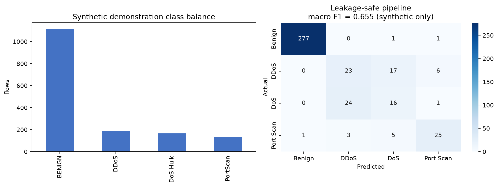

# CIC-IDS2017 Intrusion Detection

[](https://github.com/Bahareh527/cicids2017-intrusion-detection/actions/workflows/ci.yml)
[](https://www.python.org/)
[](LICENSE)

A reproducible, leakage-aware machine-learning workflow for binary and multiclass network-intrusion detection with the CIC-IDS2017 flow dataset.



## What this repository demonstrates

- Memory-conscious loading and cleaning of the eight CIC-IDS2017 CSV files
- Consistent normalization of corrupted and variant attack labels
- Stratified train/test evaluation with preprocessing fitted on training data only
- Binary logistic-regression and multiclass Random Forest baselines
- SMOTE inside an imbalanced-learn pipeline, so synthetic samples never leak into the test set
- Balanced accuracy, macro F1, per-class recall, and confusion matrices instead of accuracy alone
- A small deterministic synthetic example for CI; synthetic scores are not presented as research results

## Why this is a clean-room rebuild

The original coursework notebook contained valuable exploration, but it was a 15 MB Colab artifact with hard-coded Drive paths and preprocessing performed before data splitting. It also applied SMOTE before the train/test split, allowing related synthetic points to appear on both sides of the evaluation. This repository preserves the research intent while correcting those issues.

| Original workflow | Rebuilt workflow |
|---|---|
| Google Drive paths | Dataset-directory command line interface |
| Scaling and PCA before splitting | Preprocessing fitted inside the training pipeline |
| SMOTE before splitting | SMOTE applied only during model fitting |
| Overall accuracy emphasized | Balanced accuracy, macro F1, and per-class metrics |
| Large stateful notebook | Tested package plus compact reproducible notebook |

## Dataset

The dataset is intentionally not redistributed. Download `MachineLearningCSV.zip` from the [official CIC-IDS2017 page](https://www.unb.ca/cic/datasets/ids-2017.html), extract the CSV files, and place them in `data/raw/`. Review the dataset provider's terms and cite its paper when publishing results.

```text
data/raw/
├── Monday-WorkingHours.pcap_ISCX.csv
├── Tuesday-WorkingHours.pcap_ISCX.csv
└── ...
```

## Installation

```bash
git clone https://github.com/Bahareh527/cicids2017-intrusion-detection.git
cd cicids2017-intrusion-detection
python -m venv .venv
# Windows: .venv\Scripts\activate
# macOS/Linux: source .venv/bin/activate
python -m pip install -e .
```

## Train a baseline

```bash
cicids-train data/raw --task binary --sample-fraction 0.10
cicids-train data/raw --task multiclass --sample-fraction 0.10
```

Sampling occurs deterministically within each source file before concatenation. Increase the fraction only when memory allows.

## Reproducible demonstration

The [notebook](notebooks/leakage_aware_intrusion_detection.ipynb) runs the complete pipeline on labeled synthetic flow features. It validates software behavior without downloading or claiming performance on CIC-IDS2017.

```bash
python -m pip install -e ".[notebook,dev]"
python scripts/generate_demo.py
ruff check .
pytest
```

## Attribution

Project authorship is recorded in [CITATION.cff](CITATION.cff), and copyright attribution remains in [LICENSE](LICENSE).

The dataset was introduced by I. Sharafaldin, A. Habibi Lashkari, and A. A. Ghorbani, “Toward Generating a New Intrusion Detection Dataset and Intrusion Traffic Characterization,” ICISSP 2018, pp. 108–116. [doi:10.5220/0006639801080116](https://doi.org/10.5220/0006639801080116)

## Limitations

- CIC-IDS2017 is a controlled benchmark from 2017 and does not represent current production traffic by itself.
- Random stratified splits can overestimate deployment performance when temporal or host-specific patterns repeat. A day- or environment-based external evaluation is recommended.
- This project is defensive research software, not a deployable intrusion-prevention system.

## License

The repository code is available under the [MIT License](LICENSE). CIC-IDS2017 is not included and remains governed by its provider's terms.
